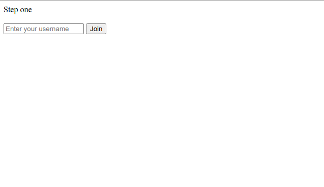
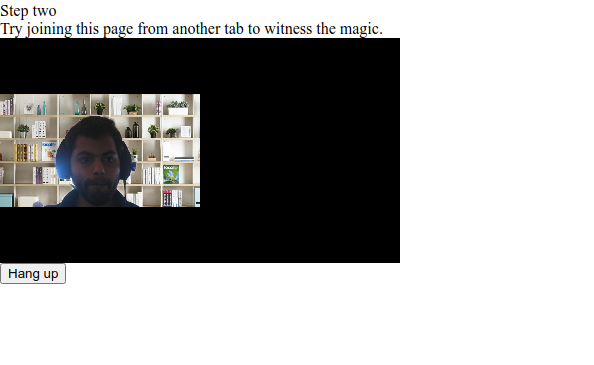

# SignalWire Vectorly API Integration

This is an example repository showing how to integrate Vectorly's Background Filter with SignalWire's Video API.

## Pre-requisites

**SignalWire**

Follow [this tutorital](https://signalwire.com/resources/getting-started/video-api) to sign up for an account at SignalWire, and get your `Project ID` and an `API Token`

Then, set the following environmental variables:

```bash
SW_API_TOKEN=...
SW_PROJECT_ID=...
SW_NAMESPACE=...
```

**Vectorly**

Sign up for a Vectorly account [here](https://ai-filters.vectorly.io/) and get your Vectorly token

Set your Vectorly token in an environent variable

```bash
VECTORLY_TOKEN=...
```

## Running the demo

1. Go to the project root and run `npm install`
2. Run `npm start`

It should open a browser window, where you can then view a Signal Wire demo with Virtual Backgrounds integrated

**Step 1**: Enter your user name


**Step 2**: You should see your camera feed with a virtual background

