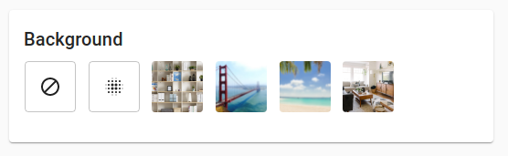

# UI Quickstart Components

This repo contains code for a basic UI widget for a virtual Backgrounds feature.

It is written in pure HTML5, Javascript and CSS. You can copy, paste and modify as necessary for a quick proof-of-concept.

To run locally, you can open the local index.html file in your browser, and include the url parameter `token`, as in `index.html?token=<your-vectorly-token>`

